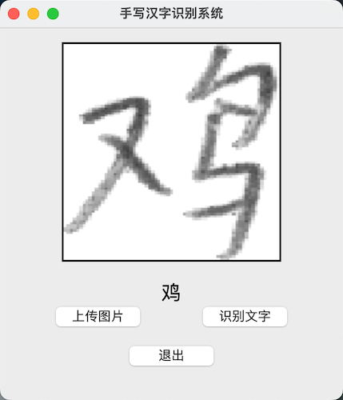

# 手写汉字识别系统

基于Vision transformer(MAE)模型微调的PyQT手写汉字识别系统，使用pytorch框架实现。
- 模型：hugging face的 `mae` 接了一层线性分类头;
- 效果：没调参直接跑了 10 轮（3755类），验证集Acc：90%
  


## 项目结构

- `imgs/`: 存放测试的图片文件。
- `src/`: 存放项目训练模型的源代码。
  - `char_dict.json`: 标签文件。
  - `data_handler.py`: 数据处理模块。
  - `inference.py`: 推理模块。
  - `models.py`: 模型和配置模块。
  - `my_dataset.py`: 数据集模块。
  - `train.log`: 训练日志文件。
  - `trainer.py`: 训练模块。
- `main.py`: PyQT界面的程序入口。

## 使用方法

### 1. 训练模型
#### 1.1 数据集
本项目用的中科院自动化所公开的手写汉字数据集，共有3755类。
```bash
wget http://www.nlpr.ia.ac.cn/databases/download/feature_data/HWDB1.1trn_gnt.zip
wget http://www.nlpr.ia.ac.cn/databases/download/feature_data/HWDB1.1tst_gnt.zip
```
#### 1.2 数据格式转换
```bash
cd src/
python data_handler.py
```
### 1.3 训练数据
```bash
cd src/
python trainer.py
```
### 2.使用PyQT界面操作
 ```bash
 python main.py
```
 
## 许可证

该项目基于 [开源许可证类型] 许可证。更多详情请查阅 [LICENSE](LICENSE) 文件。

如有任何问题或建议，请随时提出。


